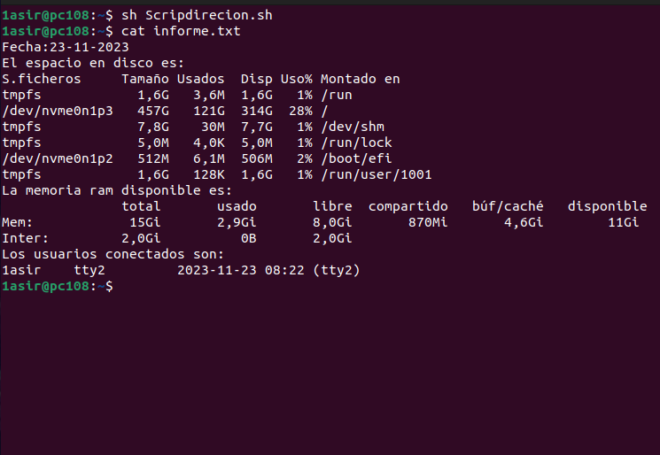

# Redirecionamiento
## Genera un archivo llamado informe.txt que contenga la siguiente informacion: 
La fecha del sistema formateada; 
El espacio en disco(df -h);
Memoria ram libre (free -h);
Usuarios conectados;
Hay que subir una imagen de que el scrip ha sido ejecutado con exito.
```
#!/bin/bash
echo "Fecha:$(date "+%d-%m-%Y")" >> informe.txt
echo "El espacio en disco es:" >> informe.txt
df -h >> informe.txt
echo "La memoria ram disponible es:" >> informe.txt
free -h >> informe.txt
echo "Los usuarios conectados son:" >> informe.txt
who >> informe.txt
```

